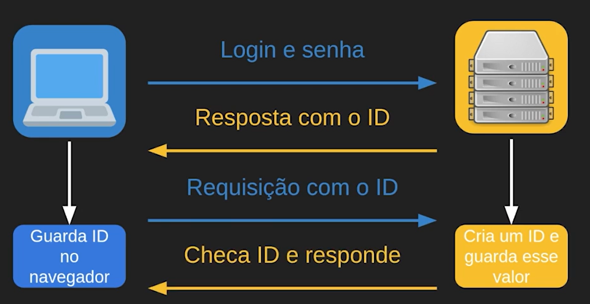
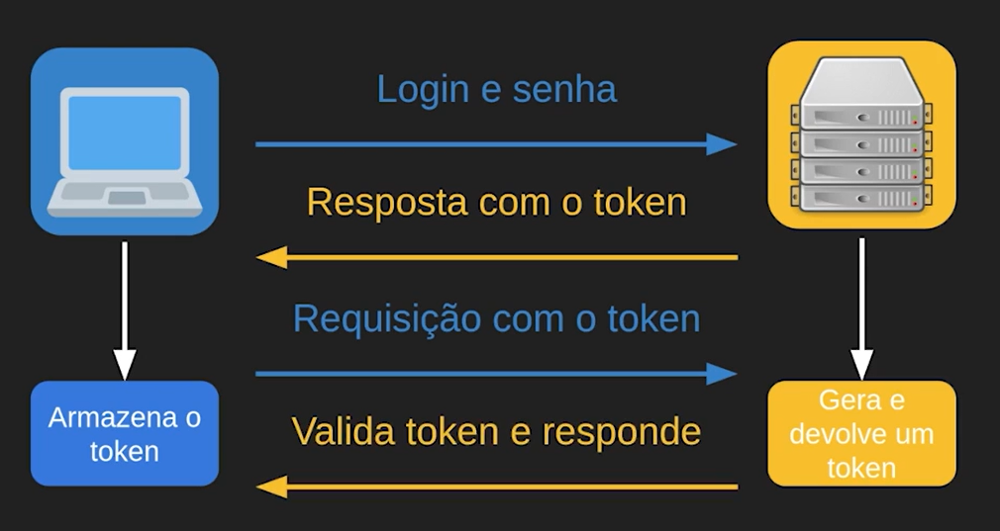

# Sessões e Tokens

Para entender o que sessões e tokens significam e suas relações com a segurança, precisamos definir esses conceitos.

## - Sessão: **Quantidade de tempo em que o usuário está autenticado e conectado a um serviço ou um sistema**.

Para demonstrar como essas sessões podem funcionar, teremos uma versão simplificada do protocolo HTTP. Mostraremos algumas respostas e requisições e pensaremos em como funciona esse protocolo e sua autenticação.



---

Essa estratégia funciona para a maioria dos casos. Porém, **há aplicações que dependem de escala, que possuem bastantes bancos de dados, centros de distribuições** ou dependendo da arquitetura do sistema, buscar por esse ID pode **não ser uma tarefa tão simples**, pode ser custosa.

Outro cenário menos comum **é um terceiro obter o identificador e se passar pelo usuário.**

---

## - Token: Ao invés do servidor gerar um valor, armazenar e ficar se comunicando com o usuário, **é gerado uma hash de uma determinada informação e enviado de volta para o usuário.**


**O usuário apenas aguarda essa hash, não consegue ler e não possui capacidade de utilizar**. Como se fosse uma assinatura, por exemplo, que **não é possível desencriptar**. 

Quando o usuário for fazer uma requisição, ele vai mandar esse token de volta e ao invés do servidor pesquisar e localizar esse ID, **ele simplesmente valida o token, ou seja, vai decifrar a informação**.



---

## JWT: Oque é?

JWT, em tradução: JSON WEB TOKEN, é basicamente uma forma de segurança de um token em estrutura JSON JavaScript, muito usado em serviços web.

***[JWT website](https://jwt.io/)***

Ele é formado por um corpo dividido em 3 partes que formam assim:

1. O tipo do token e o formato: 

```json
{
  "alg": "HS256",
  "typ": "JWT"
}
```

2. O corpo em si do que é mandado na mensagem de token: 

```json
{
  "sub": "1234567890",
  "name": "John Doe",
  "iat": 1516239022
}
```

3. A assinatura, o que basicamente verifica a vericidade daquele token:

```json
HMACSHA256(
  base64UrlEncode(header) + "." +
  base64UrlEncode(payload),
  
your-256-bit-secret

)
```

--- 

## Código:

Vamos começar a implementação de uma verificação usando um token em JWT!

